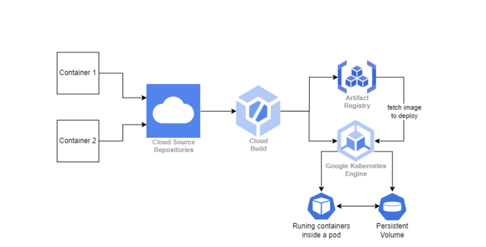
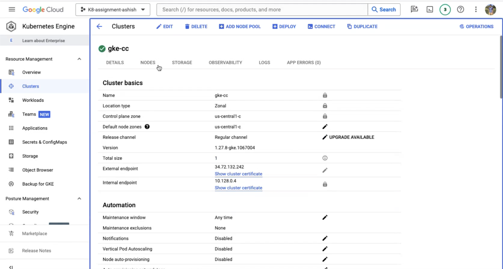
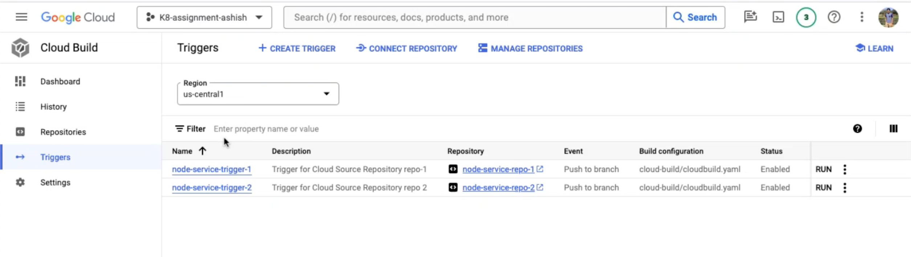
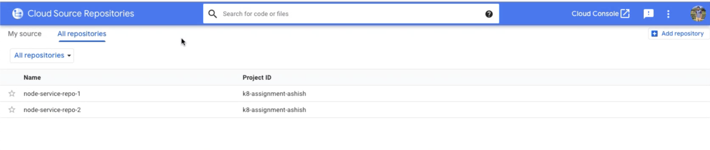
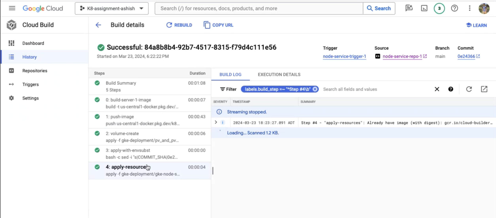
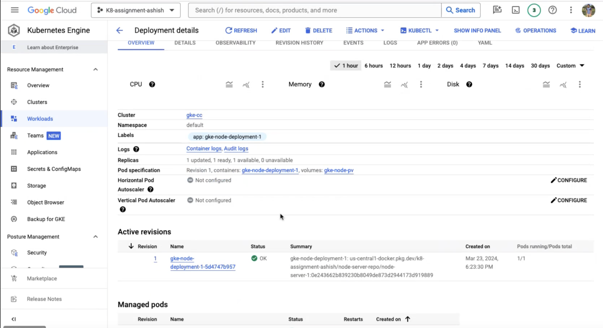

# Mikubon

A containerized API server 

## Links

1. Github Repo -  https://github.com/ashishnagpal2498/Mikubon
2. Deployment Link - 

# Project Requirements

### What to Build ?
The requirement of the project was to develop two **microservices** which communicate with each other internally. The services must be deployed on GCP via **_CI/CD pipeline_** which deploys the service to GKE. In GKE there should be a persistent volume which can be accessed by both containers to store and retrieve file data. Cloud Source Repository (a tool similar to Gitlab) and Artifact Registry (a tool similar to Docker Hub) should be used to store the **source code** and ``Docker images`` respectively and images should be deployed to GKE clusters. The GKE cluster must be created using Terraform script.


<center style= text-align="center" >Figure 1: Infrastructure </center>  <br>

- **Container 1**  
The role of the first container is to be able to store the files to a persistent volume in GKE and serve as a
gatekeeper to calculate the products from the stored file. It must:
    1. Be deployed as a service in GKE to be able to communicate with the Internet.
    2. Have access to persistent volume in GKE to store and retrieve files.
    3. Be able to communicate with container 2 and vice versa.
    4. Validate the input JSON request incoming from the REST API.
    5. Send the “file” parameter to container 2 to calculate the product from the “product” parameter in the API and return the response from container 2.

- **Container 2**  
The role of container 2 is to listen on another port and endpoint that you define for the service and
returns the total of the product. It must:
    1. Have access to the persistent volume of GKE.
    2. Container 2 should be able to interact with container 1 and vice versa.
    3. Calculate the total of the product by calculating the sum of rows of the same product from the given file.
    4. Return the total in the appropriate JSON format, or an error indicating the file is not a proper CSV file in the appropriate JSON format.

### Motivation of the project
This project was part of **Cloud Computing** course assignment. Three weeks were given to complete it along with expectation to self learn the CI/CD deployment on GCP and infrastructure as code via Terraform. 

### Status achieved ?

I was successfully able to achieve all the requirements of the assignment and secured ``110%`` ( Bonus points for submitting the assignment, 2 days before the deadline). Moreover, I created all the required resources - **Cloud Source Repository**, **Build Triggers**, **Compute Disk** through Terraform. This provides scalability and reliability to the project and ensure that it can be extended for future scope. 

### How did I start ?

My approach for the assignment was to narrow down the requirements, develop the microservice and execute locally and then focus on the deployment. Therefore, I created the **NodeJs** servers as per the requirement, containerized those using ``Dockerfile`` and tested it locally. When everything was working, I then tried to deploy the containers on GKE cluster manually to understand how it works. Following this, I wrote yaml files to create deployment, persistent volume, persistent volume claim and service in kubernetes. Next, I tried to perform CICD on this by creating cloudbuild triggers on cloud source repository. Lastly, I created my entire infrastructure via Terraform. 


# Challenges 

While deploying this application, what challenges I encountered and how did I overcome it:

- Persistent volume and claim - Initially, I struggled thinking how to create persistent volume, claim and disk. Then after searching, I understood that a disk is created automatically when a persistent volume is created and disk is not defined. Or we can create a disk and create persistent volume using that disk.

- Re-deploy to Kubernetes Cluster - Using latest tag of the images in the deployment files doesn't update the deployment if there isn't any configuration change. Therefore, I used ``sed`` command to append the ``COMMIT_SHA`` of the build in the deployment file.


# Installing

### Pre-requisites:

- NodeJs (16x) and Npm or higher version installed
- Docker desktop
- Text editor or Integrated Development Environment (IDE) such as VScode.


### Installation Steps:

- Clone the Repository:

    ```bash 
    Https - 
        git clone https://github.com/ashishnagpal2498/Mikubon

    SSH
        git clone git@github.com:ashishnagpal2498/Mikubon.git
    ```

- Navigate to the Project Directory:

    ```bash
    cd Mikubon 
    ```

- Install dependencies:  
    Server 1
    ```bash
    cd  microservice-nodejs-1
    npm install
    ```
    Server 2
    ```bash
    cd  microservice-nodejs-2
    npm install
    ```
- Running the servers separately:

    ```bash
    npm start
    ```

# Deployment

This repository is deployed on GKE using terraform. The c

1. Create a project on GCP cloud.

2. Enable APIs
    - Kubernetes Engine API 
    - Cloud Build API 
    - Compute Engine API 
    - Cloud Source Repositories API 

3. Open Cloud shell, copy the contents of iac.tf to the shell and change the following variables
    - project - <Name of the project given>
    - service_account - Compute engine IAM role.

4. Execute the terraform script using ``terraform apply`` command.

5. Once the script is completed, push the code of both the microservices to the cloud source repositories created via terraform.

6. View the first deployment and use the URL to view the service. 


## Screenshots


Figure 2: GKE Cluster <br>


Figure 3: Build Triggers <br>



Figure 3: Cloud Source Repository <br>


Figure 4: Trigger Execution <br>


Figure 5: Deployment <br>


## Acknowledgments
1. **Node.js Community:** We are grateful to the Node.js community for their extensive resources and tutorials. The asynchronous nature of Node.js has taught us to think differently about programming logic and structure.
2. **Express.js Framework:** Express.js has been instrumental in understanding how to set up a server, handle requests, and build APIs. The simplicity and flexibility of Express.js have made backend development more approachable.
3. **DevOps Community:** The coding community’s dedication to sharing knowledge through articles, blogs, and videos has been invaluable. Their insights have helped me contribute more effectively to the projects.

## References

1. “Kubernetes Tutorial for Beginners [FULL COURSE in 4 Hours],” Youtube.com. [Online]. Available: https://www.youtube.com/watch?v=X48VuDVv0do&t=12265s&pp=ygUla3ViZXJuZXRlcyBnY3AgdHV0b3JpYWwgZm9yIGJlZ2lubmVycw%3D%3D. [Accessed: 12-May-2024].